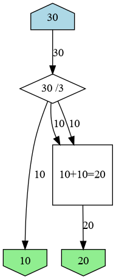
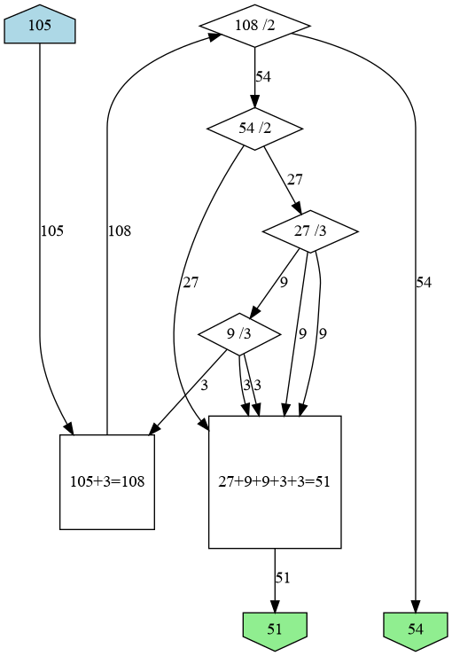
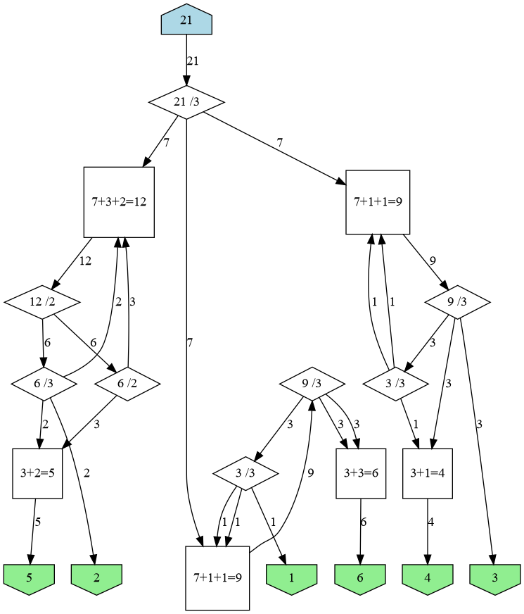
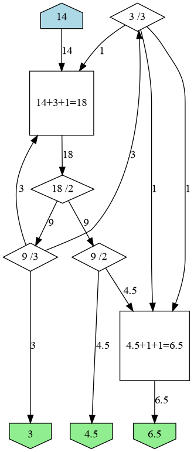

### Satisfactory tool splitter

A tool to help calculate how to split conveyors in Satisfactory into specific ratios.

## Why?

Your factory produces A+B+C items per minute.
A+B of these items, you need for your production chain inside that factory.

The remaining C of them, you need to transport via vehicles to another factory.

If you used a simple splitter, (A+B+C)/3 items would be queued for transport via vehicle.
Because vehicles transport _everything_ you have available,
regardless of whether there is room in target for the items or not,
your local factory will be starved and the destination factory will be swamped with
incoming items, or vice versa.

Using accurate conveyer splitting, you can ensure that the offshore factory
will receive exactly C items per minute, not less and not more.

## Usage examples

    python3 smartsplit 10 20

    python3 smartsplit 54 51

    python3 smartsplit 1 2 3 4 5 6

    python3 smartsplit 4.5 6.5 3

    python3 smartsplit 151 71 5

## Dependencies

The following libraries are required: graphviz platformdirs functools fractions pathlib bisect pickle sys os.
Of these, I believe graphviz and platformdirs need to be separately installed:

``pip3 install -r requirements.txt``

### Graphviz

Output is done with a Graphviz Digraph. From each node, there is an arrow pointing to where it goes.
When graphing, nodes are displayed in a few different ways depending on what it represents.

Inputs are houses, Outputs are inverted houses, splitters are Diamonds and mergers are Squares.

Currently, a chain of mergers will be condensed into a single merger.
This gives you liberties with how you want to set up the merges,
without changing the function of the graph.

## Caching

Caching is used to avoid duplicate computation.
The cache file is typically found in:

* Mac OS X: `~/Library/Caches/smartsplit/smartsplit.cache`
* Linux: `~/.cache/smartsplit/smartsplit.cache`
* Win XP: `C:\Documents and Settings\<username>\Local Settings\Application Data\bisqwit\smartsplit\Cache`
* Vista: `C:\Users\<username>\AppData\Local\bisqwit\smartsplit\Cache`

## Algorithm

* Is the number of goals $n=0$? If so, output zero and quit.
* Is the number of goals $n=1$? If so, pass input directly into output and quit.
* Can the goals be divided into 2 or 3 groups that have exactly the same sum? If so, use a single divider to create 2 or 3 goals.
Recursively solve these independent goals, and then quit.
* Can we find a single real number (greatest common divisor) $M\in\mathbb{R}$
such that every goal $G_i \in \mathbb{R}$ can be expressed as $N_i\cdot M$
for some $N_i\in\mathbb{N},\ N_i\le 10$?
If so, split goal $G_i$ into $N_i$ new goals of $M$,
and recursively solve these new goals.
If a solution is found, reconstitute the original goals $G_i$
by merging $N_i$ instances of $M$-valued outputs together
and use this as a solution.
* Is the number _not_ divisible by some $Q \in \\{3,\\,2,\\,6\\}$?
If so, calculate a _miss_ value $M$ such that
$M+\sum G = Q\lfloor\frac{M+\sum G}{Q}\rfloor$,
or $M=Q-(\sum G\mod Q)$,
and create a new group of goals $G \cup \\{M\\}$
and recursively solve this new group.
If a solution is found, create a merge between the original input
and one of the $M$-valued outputs, pass the result of this merge
as the input to the subsolution, and use this as a solution.
* Is there a way to split the goals into 2 groups $A$ and $B$
such that
$A = \left( G_0 \dots G_{i-1},\\,\alpha\cdot G_i \right)$,
$B = \left( (1-\alpha)\cdot G_i,\\,G_{i+1}\cdot G_{n-1} \right)$,
and $\sum A + \sum B = \sum G$? (Yes, it always is if $n\ge 2$.)
If so, create a single divider to create two groups $A$ and $B$,
and recursively solve both groups.
Then take one of the outputs valued $(1-\alpha)\cdot G_i$,
one of the outputs valued $\alpha\cdot G_i$, and merge them together to
form the original $G_i$, and use this as a solution.
* Is there a way to split the goals into _three_ groups $A$, $B$ and $C$,
such that
$A = \left( G_0 \dots G_{i-1},\\,\alpha\cdot G_i \right)$,
$B = \left( (1-\alpha)\cdot G_i,\\,G_{i+1}\cdot G_{j-1},\\,\beta\cdot G_j \right)$,
and
$C = \left( (1-\beta)\cdot G_j,\\,G_{j+1}\cdot G_{n-1} \right)$,
and $\sum A+\sum B+\sum C=\sum G$? (Not always possible.)
If so, create a single divider to create three groups $A$, $B$ and $C$,
and recursively solve all three.
Then take one of the outputs valued $\alpha\cdot G_i$,
one of the outputs valued $(1-\alpha)\cdot G_i$,
and merge them together to form the original $G_i$;
likewise take one of the outputs valued $\beta\cdot G_j$,
one of the outputs valued $(1-\beta)\cdot G_j$,
and merge them together to form the original $G_j$,
and use this as a solution.

## License

[MIT](https://choosealicense.com/licenses/mit/)

## Thanks

Thanks to [IceMoonMagic](https://github.com/IceMoonMagic/Satisfactory-Splitter-Calculator)
whose splitter source code I read for ideas.
His splitter has more features (such as taking into account different tool belt speeds),
but my tool produces chains with fewer nodes.

OpenAI’s ChatGPT was used to write portions of the code,
particularly the files `cut3.py` and `partition.py`.

